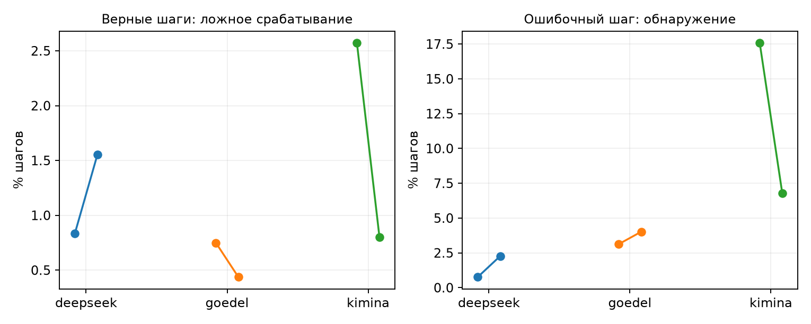

## One Big Jump: выполненные проверки и новый запуск

Срез: 15.09.2026 01:39 по Москве. Все численные таблицы построены программой из метрик и журналов. Основные завершённые эксперименты сохранены; новые проверки находятся в отдельной ветке артефактов.

Выполнена совместная проверка очищенной Kimina, раздельной калибровки и начала формального доказательства. Проведён случайный аудит разметки и дополнительная проверка прямым компилятором Lean. Протокол нового P2 зафиксирован до новых ответов. Для DeepSeek и Goedel собран отдельный набор с проверенными эталонами; генерация поставлена в очередь. Расширение P5 начинается с отдельной калибровочной части.

Универсальная связь «максимальный скачок всегда означает ошибку» по-прежнему не установлена. Исправления измерений не превращают повторный анализ старых задач в независимое подтверждение. Новое воспроизведение предназначено именно для такой проверки.

## Раздельная калибровка и формальное начало

В очищенной Kimina удалены сохранённые наблюдения после завершения уже верного доказательства. Для нового X0 берётся последний исходный токен на границе начала формального тела доказательства. Токен, захватывающий содержательный текст первой тактики, не используется как начало. Это явно отличается от исходного определения статьи, где X0 находится в конце промпта.

| Модель | Трасс в парном сравнении | Нет формальной границы | Удалено конечных шагов |
| --- | --- | --- | --- |
| deepseek | 2486 | 0 | 0 |
| goedel | 2381 | 0 | 0 |
| kimina | 2265 | 0 | 988 |

Внутри прежней калибровочной части задачи разделены на две непересекающиеся группы: одна обучает среднее и ковариацию, другая задаёт порог верхнего процентиля. Направления разбиения поменяны местами; проверены все заранее указанные значения shrinkage. Оценочные задачи не используются ни для преобразования, ни для порога.

| Модель | Fit fold | Ложные срабатывания на верных шагах | Обнаружение ошибочного шага | Top1 скачок | Top1 surprisal |
| --- | --- | --- | --- | --- | --- |
| deepseek | 0 | 0.83% | 0.76% | 24.43% | 17.61% |
| deepseek | 1 | 1.55% | 2.27% | 23.67% | 17.61% |
| goedel | 0 | 0.75% | 3.12% | 25.45% | 13.17% |
| goedel | 1 | 0.44% | 4.02% | 23.21% | 13.17% |
| kimina | 0 | 2.57% | 17.59% | 17.28% | 12.04% |
| kimina | 1 | 0.80% | 6.79% | 14.20% | 12.04% |

В таблице доли top1 имеют вес попыток. Ложные срабатывания измеряются на шагах целиком верных оценочных доказательств; обнаружение — на локализованном первом неверном шаге. Порог и argmax отвечают на разные вопросы. Низкая частота ложных срабатываний не означает высокой чувствительности.

| Модель | Fit fold | Задач | Top1: скачок − surprisal, п.п. | 95% интервал, п.п. |
| --- | --- | --- | --- | --- |
| deepseek | 0 | 122 | -0.80 | [-7.76; +6.09] |
| deepseek | 1 | 122 | +1.67 | [-5.80; +9.13] |
| goedel | 0 | 122 | +8.31 | [+1.26; +15.47] |
| goedel | 1 | 122 | +6.37 | [-0.66; +13.23] |
| kimina | 0 | 94 | +8.54 | [+0.39; +16.80] |
| kimina | 1 | 94 | +4.01 | [-3.84; +12.07] |

Здесь каждой прежней задаче дан одинаковый вес, а преобразование зафиксировано. Интервалы номинальные и описательные: эти данные уже многократно анализировались, поэтому положительная граница не является новым подтверждением. У DeepSeek результат при таком взвешивании близок к нулю. Все варианты, включая противоположное разбиение и другие значения shrinkage, сохранены в полном metrics.json.

## Случайный аудит Lean

Всего случайно отобрано и повторно проверено 133 ответов. Совпало 133 исходных категорий; точная локализация воспроизвелась в 36 выбранных случаях, для которых она ранее была установлена. Отбор выполнен без использования величины скачка или surprisal.

| Модель | Проверено | Категории совпали | Верные: подтверждены Lean CLI | Разногласия CLI, кроме обрывов |
| --- | --- | --- | --- | --- |
| deepseek | 43 | 43 | 6/6 | 0 |
| goedel | 42 | 42 | 6/6 | 0 |
| kimina | 48 | 48 | 6/6 | 0 |

Отбор стратифицирован: отдельно проверены верные доказательства, ранняя и более поздняя локализованная ошибка, отсутствие надёжной локализации, незакрытые цели, обрыв генерации, ресурсные/контекстные исключения и ошибки формата. Малые категории включались полностью. Это не простая случайная выборка всех ответов, поэтому объединённую долю нельзя выдавать за несмещённую оценку частоты ошибок разметки.

| Страта | DeepSeek | Goedel | Kimina |
| --- | --- | --- | --- |
| verified | 6 | 6 | 6 |
| localized_first | 6 | 6 | 6 |
| localized_later | 6 | 6 | 6 |
| localization_unavailable | 6 | 6 | 6 |
| terminal_unsolved | 1 | 0 | 6 |
| truncated | 6 | 6 | 6 |
| resource_compatibility | 6 | 6 | 6 |
| format_other | 6 | 6 | 6 |

Повтор через REPL проверяет воспроизводимость существующего конвейера. Прямой запуск Lean CLI дополнительно проверяет целое доказательство другим путём подачи исходника и аудит зависимостей теоремы. Эти проверки используют одну версию Lean и одно доверенное формальное утверждение; они не доказывают соответствие формализации неформальному тексту задачи.

deepseek: отдельный компилятор — {'source_excluded': 5, 'standalone_checked': 38}. Обрыв с целым допустимым сертификатом: 0.

goedel: отдельный компилятор — {'source_excluded': 7, 'standalone_checked': 35}. Обрыв с целым допустимым сертификатом: 0.

kimina: отдельный компилятор — {'source_excluded': 9, 'standalone_checked': 38, 'standalone_resource_timeout': 1}. Обрыв с целым допустимым сертификатом: 0.

Ошибка тактики означает, что конкретное применение тактики не прошло проверку. Незакрытая цель означает, что после доступного тела остаётся недоказанное обязательство; это не обязательно неверность последней выполненной тактики. В таких случаях условная привязка отказа к последней позиции не должна подменять надёжно воспроизведённую локализацию.

Обрыв по лимиту генерации сохраняется отдельным исходом. Ресурсный предел, несовместимость окружения, изменение утверждения моделью и ошибка формата тоже остаются отдельными категориями. Их нельзя автоматически объявлять математической ошибкой конкретного шага.

## Новый набор для воспроизведения

Источник — исправленный ProofNet-Verified, зафиксированный git commit 160414332dc196583f6c37c310b420d2a3b07c58. Источник указывает Lean 4.28; эталон проверяется в фактическом закреплённом окружении проекта. Основное окружение не обновлялось.

В исходных эталонных файлах встречаются одновременно исходные и исправленные утверждения; встречается и повторяющееся имя задачи. Итоговый идентификатор включает номер записи. Проверяется не совпадение имени, а новое объявление с точным утверждением из JSON и с допустимыми зависимостями доказательства. Эталонные доказательства и неформальные решения не входят в промпты моделей.

| Показатель | Значение |
| --- | --- |
| Кандидатов после проверки прежней генерации | 364 |
| Задач с прошедшим эталоном | 236 |
| Групп упражнений | 221 |
| Групп технического пилота | 24 |
| Групп независимой оценки | 197 |

| Исход проверки эталона | Задач |
| --- | --- |
| reference_incompatible | 113 |
| reference_verified | 236 |
| context_statement_mismatch | 1 |
| reference_unapproved_axiom | 14 |

| Модель | Всего новых попыток | Технический пилот | Независимая оценка |
| --- | --- | --- | --- |
| deepseek | 944 | 104 | 840 |
| goedel | 944 | 104 | 840 |

Этот набор новый для истории генерации данного проекта. Отсутствие задач в предобучении моделей не установлено. Переход от miniF2F к учебниковым задачам меняет предметную область; новое исследование проверяет перенос результата, а не точное повторение исходного распределения задач.

## Зафиксированный протокол подтверждения P2

Единица веса — группа независимого упражнения. Сначала усредняются пригодные попытки одной задачи, затем задачи внутри упражнения, затем сами группы. Подпункты одного упражнения не считаются отдельными независимыми наблюдениями.

Goedel: основной результат — средняя разность top1 между скачком и surprisal. DeepSeek: основной результат — точное совпадение максимума с ошибкой после первого наблюдения, когда первое приращение исключено, сверх позиционного контроля по учебнику и точной длине.

Для DeepSeek один представитель упражнения выбирается детерминированно по хешу до фильтрации позиции ошибки. Если у выбранного представителя отсутствует формальная граница, другой ответ вместо него не подбирается. Затем ошибки переставляются только внутри групп одинакового учебника и длины. Одиночные страты отдельно учитываются как несопоставимые.

В семействе два основных утверждения. Для Goedel требуется положительная нижняя граница двустороннего интервала уровня 97.50%. Для DeepSeek используется односторонний точный порог 0.025. При недостатке 20 независимых групп результат считается недостаточно определённым.

Границы не зацикливаются и не обрезаются искусственно: если соседнего шага нет, соответствующий сдвиг недоступен. Основное сравнение — D=0. Сдвиги и окно около ошибки остаются дополнительными проверками, для них указываются знаменатели и доступность границ.

Слой, температура, shrinkage, формальное начало, число попыток и правило остановки заданы до новых ответов. Преобразование берётся из фиксированного направления раздельной калибровки на старых задачах; лучший вариант по новой оценке не выбирается. Предусмотрено полное завершение запланированного набора, без остановки или расширения из-за промежуточного p-value.

## Расширение контролируемого P5

| Часть | Задач | Попыток |
| --- | --- | --- |
| calibration | 1000 | 2000 |
| evaluation | 500 | 1000 |

Сначала генерируется только калибровочная часть. Для каждой температуры независимо требуются не менее 20 верных задач для обучения преобразования и столько же для отдельного выбора порога, а также достаточное качество формата и подтверждение извлечения состояний. Оценочная часть автоматически допускается только после этого условия.

P5 остаётся контролируемым семейством цепочек modus ponens со случайными именами и порядком правил. Увеличение числа экземпляров не добавляет новых логических семейств. Синтаксическое ограничение формата не выбирает математически верный следующий шаг.

Предусмотрен прогноз успеха по длине: коэффициент оценивается на калибровочных задачах, качество прогноза проверяется на оценочных и сравнивается с постоянной вероятностью, также обученной на калибровке. Все назначенные попытки, включая неверный формат и обрывы, остаются в знаменателе. Подгонка зависимости от длины сама по себе не определяет экстремальный индекс, порог или тяжёлохвостый механизм.

## Очередь, контроль и оставшиеся действия

Состояния планировщика ниже относятся к моменту 2026-09-14T22:39:54.435171+00:00. Численное время ожидания GPU не гарантируется: срок выдачи ресурса определяется планировщиком.

| Этап | Статус | Заявки |
| --- | --- | --- |
| calibration | COMPLETED | 8467315 |
| audit | COMPLETED | 8467339_0, 8467339_1, 8467339_2 |
| audit_cli | COMPLETED | 8467357_0, 8467357_1, 8467357_2 |
| references | COMPLETED | 8467338_0, 8467338_1, 8467338_2, 8467338_3 |
| p2_setup | COMPLETED | 8467346 |
| p5_calibration | PENDING (Priority) | 8467324 |
| p5_evaluation | NOT_SUBMITTED |  |
| p2_generate | PENDING (Priority) | 8467351 |
| p2_verify | NOT_SUBMITTED |  |
| p2_extract | NOT_SUBMITTED |  |
| p2_analyze | NOT_SUBMITTED |  |
| p5_analysis | NOT_SUBMITTED |  |
| provenance_repair | COMPLETED | 8467356 |
| flow_checks | COMPLETED | 8467358 |

Новый контроллер проверяет задания раз в 30 минут, запускает подготовленные зависимые этапы и может дважды продолжить сохранённый журнал после тайм-аута, отказа узла или вытеснения. Ошибка программы, схемы или целостности данных не обходится автоматически. Старые задания не отменяются. Сообщения из cron в этот чат не подключены.

Следующие действия уже описаны в коде: завершить генерацию нового P2, выполнить Lean и точную сегментацию, извлечь состояния, применить зафиксированное преобразование и посчитать основные сравнения; для P5 — завершить калибровку, проверить допуск, затем получить независимую оценку. Результаты этих ещё не завершённых этапов в этом отчёте не заявляются.

## Артефакты и воспроизведение

Корневая папка нового запуска на сервере: /beegfs/home/denis.rakhmankin/onebigjump/runs/followthrough_20260915_v1. Протокол подтверждения: /beegfs/home/denis.rakhmankin/onebigjump/audit/followthrough_20260915_v1/p2-confirmatory-protocol.json. Состояние контроля: /beegfs/home/denis.rakhmankin/onebigjump/runs/followthrough_20260915_v1/flow/latest.json.

В технических манифестах исправлены ссылки на временные пути REPL внутри контейнера: они заменены постоянными файлами с теми же наблюдёнными SHA256. Исходные версии манифестов и журнал исправления сохранены; численные выходные файлы не менялись.

Код сохранён отдельно с хешами и отметкой dirty. Базовый commit не включает все сохранённые изменения, поэтому одного git checkout недостаточно. В компактном архиве есть отчёт, метрики, журналы выбранного аудита и исходники новых этапов; большие веса моделей и матрицы состояний в архив не включены.

Источник набора: https://github.com/marcusm117/ProofNet-Verified . Формальные определения проекта: docs/experimental_specification.md. Все экспериментальные числа происходят из перечисленных в манифесте файлов проекта.
