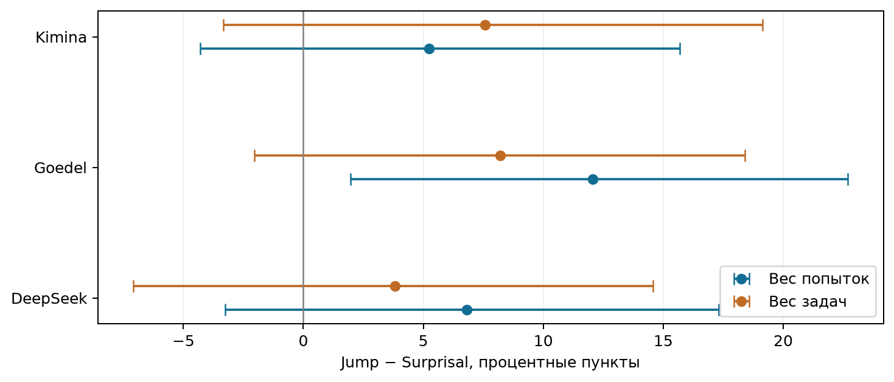
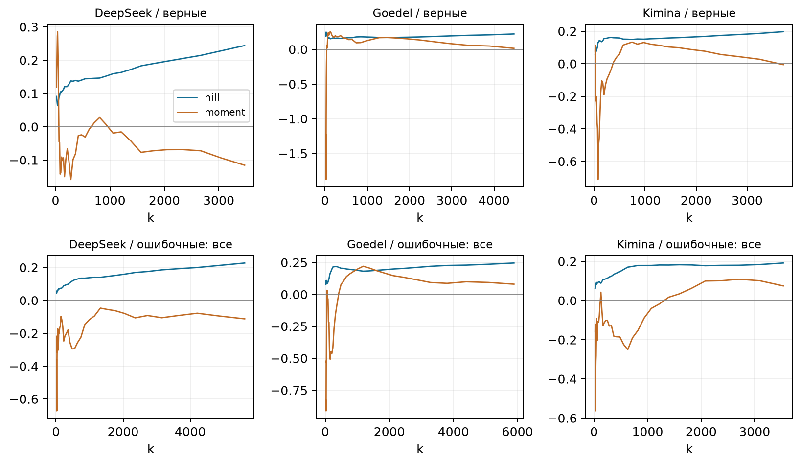
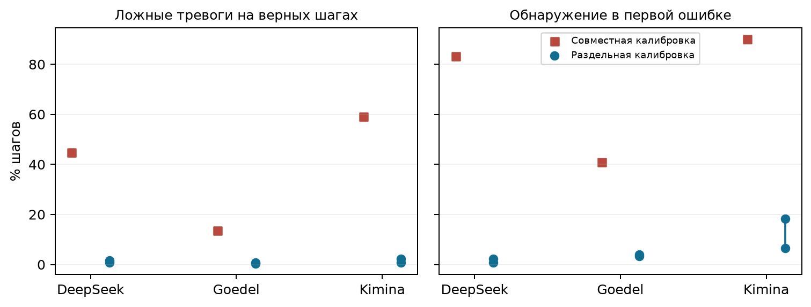
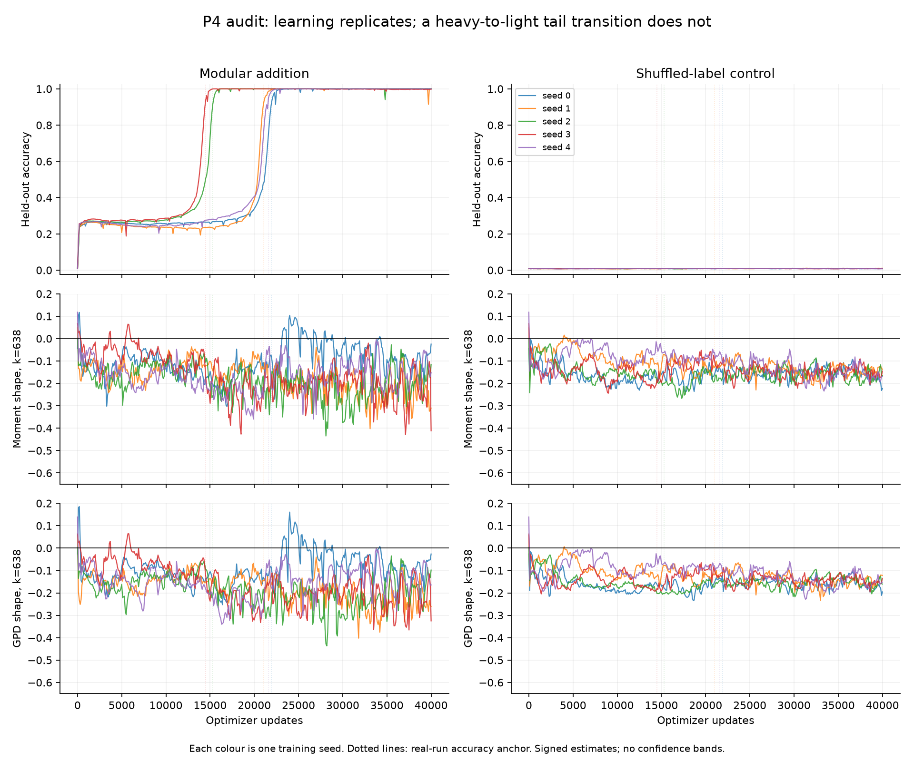

## Ревизия экспериментов One Big Jump

Срез: 15 сентября 2026 года. Научные результаты, ограничения измерений и дальнейший план. Отчёт сформирован программой из сохранённых метрик; числовые таблицы и рисунки не редактировались вручную.

Главный вывод: универсальная связь «ошибка = единственный большой скачок = тяжёлый хвост» пока не установлена. При этом найдены два ограниченных положительных результата локализации и воспроизводимая проблема калибровки порога. Это разные утверждения, и каждое требует своего контрольного сравнения.

У Goedel максимум whitened-приращения чаще совпадает с первой ошибкой, чем максимум surprisal, в выбранной ячейке при равном весе попыток. У DeepSeek есть связь с точной позицией ошибки после первого шага в небольшой сопоставленной подвыборке. Ни один результат сам по себе не доказывает тяжёлохвостый механизм.

Дополнительная проверка отделила задачи для обучения whitening от задач для выбора порога. Ложные срабатывания резко уменьшились, но уменьшилось и обнаружение ошибок. Следовательно, высокую прежнюю чувствительность порога нельзя считать самостоятельным успехом детектора.

**Карта выводов**

| Проверка | Что установлено | Что остаётся открытым |
| --- | --- | --- |
| P1: хвосты | Нет устойчивого общего разделения верных и ошибочных трасс по трём оценивателям. | Форма хвоста на доступном диапазоне; точность интервалов. |
| P2: локализация | Положительный контраст Goedel против surprisal; отдельный позиционный сигнал DeepSeek. | Перенос на новые задачи, другие веса задач и позиционные базовые методы. |
| P3: порог | Выявлена сильная чувствительность к повторному использованию калибровочных данных. | Детектор с полезной чувствительностью при заранее заданной частоте ложных тревог. |
| P4: grokking | Обобщение в real есть, в null отсутствует; хвостовой индикатор не дал надёжного разделения. | Устойчивый диагностический признак перехода и его специфичность. |
| P5: дедукция | Управление форматом устранило ошибки формата в пилоте. | Логическая правильность, достаточная калибровка и проверка зависимости от длины. |

## 1. Что закончено и какая выборка анализируется

Основное повторное извлечение состояний и последующие CPU-анализы завершились. Исправленный запуск учитывает отсутствие сохранённых token_logprobs, поддерживает фактическую архитектуру Qwen3 и устраняет конфликт имени profile.py со стандартной библиотекой. Surprisal пересчитан на сохранённом тексте; отдельная проверка совпадения с вероятностями генератора недоступна, поскольку эти вероятности в экспорте не сохранены.

**Состояние заданий из Slurm**

| Job ID | Состояние | Время работы | Exit |
| --- | --- | --- | --- |
| 8467088 | COMPLETED | 00:11:11 | 0:0 |
| 8467136 | COMPLETED | 00:00:13 | 0:0 |
| 8467157 | COMPLETED | 00:08:43 | 0:0 |
| 8467158 | COMPLETED | 00:00:06 | 0:0 |
| 8467185 | COMPLETED | 00:45:54 | 0:0 |
| 8467186 | COMPLETED | 00:46:46 | 0:0 |
| 8467184 | COMPLETED | 00:45:19 | 0:0 |
| 8467288 | COMPLETED | 00:00:22 | 0:0 |
| 8467289 | COMPLETED | 00:04:03 | 0:0 |
| 8467295 | COMPLETED | 00:00:04 | 0:0 |

**Разные знаменатели**

| Модель | Ответы | Извлечены | Верные в таблице | С ошибкой в таблице | P2: трассы / задачи |
| --- | --- | --- | --- | --- | --- |
| DeepSeek | 6672 | 5143 | 3076 | 1858 | 528 / 122 |
| Goedel | 6672 | 4873 | 3140 | 1593 | 448 / 122 |
| Kimina | 6672 | 4947 | 3353 | 1456 | 324 / 94 |

Всего учтено 20016 сохранённых ответов. «Извлечены» означает наличие результатов прохода модели; попадание в научную таблицу дополнительно требует допустимых меток и локализации. Последний столбец — только ошибочные evaluation-трассы выбранной температуры. Это не доля решённых задач и не новая оценка общей успешности модели.

Основная ячейка этой ревизии сохранена: temperature=0.6, statistic=whitened; слои DeepSeek 14, Goedel 17, Kimina 17. Разбиение на calibration/evaluation-задачи сохранено. Новая сегментация является проверкой чувствительности исходного эксперимента; старый результат с крупными блоками остаётся в истории. Дополнительные проверки этого отчёта выполнены после просмотра результатов и не объявляются новой независимой подтверждающей выборкой.

## 2. Что именно измеряют скачок, surprisal и ошибка

Xₜ — скрытое состояние на выбранной границе наблюдения. Приращение — Xₜ−Xₜ₋₁. Raw использует его евклидову норму; whitened учитывает среднее и оценённую ковариацию калибровочных приращений. Innovation дополнительно использует модель предсказания состояния. Это разные статистики с разной чувствительностью к оценке преобразования.

Surprisal — среднее отрицательное логарифмическое правдоподобие токенов соответствующего блока при условии предыдущего текста. Чем блок менее ожидаем для модели, тем больше значение. Сравнение проверяет, добавляет ли геометрия скрытых состояний информацию сверх обычной неуверенности модели. Вероятности, границы блоков, набор попыток и позиции-кандидаты должны быть согласованы.

t* — первый шаг, для которого установлена ошибка. Ошибка тактики — неудача формального шага в текущем состоянии Lean. Незакрытая цепь — после доступной последовательности остались цели; конкретный ранний математически неверный шаг может не существовать. Обрыв, несовместимость окружения и синтаксическая ошибка требуют собственных категорий.

После t* метка поглощающе равна нулю, а шаги помечены unreached: их нельзя описывать как отдельно исполненные и опровергнутые Lean. Скрытые состояния последующего сгенерированного текста доступны, поэтому офлайн-локализация может сравнивать их с t*. Это не равнозначно детектору, предупреждающему об ошибке до её совершения.

j=argmax Zₜ, D=j−t*. D=−1 означает максимум на предыдущем шаге, D=+1 — на следующем. Замена Xₜ−Xₜ₋₁ на Xₜ₋₁−Xₜ не меняет евклидову норму; сдвиг привязки приращения к шагу и изменение границ блоков меняют задачу.

## 3. P2: точное попадание в первую ошибку

**Выбранная ячейка; все допустимые evaluation-трассы с ошибкой**

| Модель | N / задачи | Jump top-1 | Surprisal top-1 | Равномерно |
| --- | --- | --- | --- | --- |
| DeepSeek | 528 / 122 | 24.4% | 17.6% | 9.7% |
| Goedel | 448 / 122 | 25.2% | 13.2% | 8.7% |
| Kimina | 324 / 94 | 17.3% | 12.0% | 8.7% |

Top-1 — доля трасс, где максимальное значение попало точно в t*. Равномерный контроль выбирает один из L шагов каждой трассы; его вероятность равна среднему 1/L. Обратная этой вероятности — гармоническое среднее длины, а не среднее число шагов.

**Длины кандидатов**

| Модель | Среднее L | Медиана L | Гармоническое L | Ошибка на первом |
| --- | --- | --- | --- | --- |
| DeepSeek | 21.3 | 15.0 | 10.3 | 7.6% |
| Goedel | 26.3 | 18.0 | 11.5 | 6.5% |
| Kimina | 21.8 | 17.5 | 11.5 | 9.9% |

Парный bootstrap выполнен с 50000 повторами. Ресэмплируются задачи целиком, со всеми относящимися к ним попытками. Интервалы ниже условны на уже оценённое преобразование whitening; неопределённость его повторного обучения в них не включена.

**Разность Jump−Surprisal, процентные пункты; равный вес попыток**

| Модель | Разность | 95% ДИ | ДИ с поправкой на 9 |
| --- | --- | --- | --- |
| DeepSeek | +6.82 | [-0.41; 14.16] | [-3.25; 17.32] |
| Goedel | +12.05 | [4.83; 19.50] | [1.96; 22.69] |
| Kimina | +5.25 | [-1.52; 12.50] | [-4.29; 15.68] |

**Чувствительность к равному весу задач**

| Модель | Разность, п.п. | 95% ДИ | ДИ с поправкой на 9 |
| --- | --- | --- | --- |
| DeepSeek | +3.82 | [-3.87; 11.51] | [-7.08; 14.58] |
| Goedel | +8.20 | [1.05; 15.39] | [-2.03; 18.40] |
| Kimina | +7.57 | [-0.26; 15.66] | [-3.34; 19.13] |

При равном весе попыток Goedel имеет положительный интервал и после сохранённой поправки. DeepSeek и Kimina имеют положительные точечные разности, но интервалы включают ноль. Равный вес задач меняет целевую величину: задача с большим числом пригодных ошибочных попыток больше не получает больший вес. У Goedel обычный интервал остаётся положительным, а интервал с поправкой включает ноль. Поэтому утверждение «лучше для средней попытки в этой выборке» обосновано сильнее, чем «лучше для средней задачи».

## 4. Преимущество зависит от метрики

**Дополнительные показатели на той же ячейке**

| Модель | Top-3 jump / surpr. | Средний ранг jump / surpr. | AUC jump / surpr. |
| --- | --- | --- | --- |
| DeepSeek | 44.5% / 47.7% | 8.4 / 6.6 | 0.569 / 0.742 |
| Goedel | 42.9% / 41.7% | 10.4 / 7.1 | 0.588 / 0.764 |
| Kimina | 40.1% / 34.6% | 9.2 / 9.2 | 0.595 / 0.658 |

Surprisal имеет более высокий сохранённый pooled AUC у всех моделей и лучший средний ранг у DeepSeek и Goedel. Следовательно, преимущество по точному максимуму не переносится автоматически на ранжирование всех шагов. Pooled AUC и попадание в t* отвечают на разные вопросы и не должны заменять друг друга.

Показатель по префиксу до t* полезен как диагностика влияния последующего текста. Но исключение всего после истинной ошибки использует её известную позицию; такой результат нельзя выдавать за готовый онлайн-алгоритм.

**Роль преобразования; top-1 на одинаковых трассах**

| Модель | Raw | Whitened | Innovation | Raw: максимум первый |
| --- | --- | --- | --- | --- |
| DeepSeek | 6.4% | 24.4% | 11.0% | 75.8% |
| Goedel | 7.8% | 25.2% | 14.7% | 36.4% |
| Kimina | 17.6% | 17.3% | 9.0% | 31.5% |

Whitening существенно меняет результат DeepSeek и Goedel. Для Kimina улучшение относительно raw не наблюдается. Первое raw-приращение часто максимально: оно содержит переход от начального контекста к первому формальному наблюдению, который может включать текст рассуждения. Для нового протокола нужно отдельно зафиксировать формальную точку входа.

## 5. Почему старые и новые проценты так различаются

Сравнение ниже использует пересечение идентификаторов одних и тех же сохранённых ответов. Модель ничего заново не решала. В каждой версии сохранены её границы наблюдений и соответствующая локализация.

**Парное сравнение сегментаций**

| Модель / версия | N | Jump | Surprisal | Случайно | D=+1 |
| --- | --- | --- | --- | --- | --- |
| DeepSeek / крупные блоки | 528 | 11.7% | 74.4% | 41.5% | 78.0% |
| DeepSeek / мелкие шаги | 528 | 24.4% | 17.6% | 9.7% | 9.3% |
| Goedel / крупные блоки | 448 | 24.3% | 63.6% | 36.2% | 58.3% |
| Goedel / мелкие шаги | 448 | 25.2% | 13.2% | 8.7% | 8.7% |
| Kimina / крупные блоки | 324 | 16.7% | 33.0% | 18.3% | 21.3% |
| Kimina / мелкие шаги | 324 | 17.3% | 12.0% | 8.7% | 14.2% |

В новой сегментации больше позиций-кандидатов, меньше ошибок на первом блоке, другие интервалы усреднения surprisal. У Goedel и Kimina собственная точность jump меняется мало, а точность прежнего surprisal падает значительно. Поэтому разворот сравнительного результата нельзя объяснять только улучшением геометрического сигнала.

Ранее очень частый максимум на следующем после ошибки блоке не воспроизводится как универсальный сдвиг при более мелком разбиении. Это сильный довод проверять смысл наблюдения и позиционный контроль до вывода о задержке сигнала.

**Отбор при сопоставлении**

| Модель | Общие трассы | Только в старой | Только в новой |
| --- | --- | --- | --- |
| DeepSeek | 528 | 86 | 0 |
| Goedel | 448 | 46 | 0 |
| Kimina | 324 | 31 | 0 |

## 6. Границы трассы и позиционный контроль

Если ошибка на первом шаге, позиция t*−1 отсутствует. Если ошибка последняя, отсутствует t*+1. В общей доле невозможное попадание считается промахом, но равномерная базовая вероятность тоже учитывает эту недоступность. Дополнительно приводится условная доля только среди трасс с существующей соседней позицией. Крайние позиции не переносятся внутрь и не замыкаются по кругу.

**Доступность соседних позиций**

| Модель | Сдвиг | Доступно / все | Jump все | Jump условно | Случайно условно |
| --- | --- | --- | --- | --- | --- |
| DeepSeek | D=-1 | 488/528 | 6.4% | 7.0% | 8.8% |
| DeepSeek | D=+1 | 528/528 | 9.3% | 9.3% | 9.7% |
| Goedel | D=-1 | 419/448 | 6.5% | 6.9% | 8.2% |
| Goedel | D=+1 | 448/448 | 8.7% | 8.7% | 8.7% |
| Kimina | D=-1 | 292/324 | 6.5% | 7.2% | 7.7% |
| Kimina | D=+1 | 291/324 | 14.2% | 15.8% | 7.4% |

При коротких трассах окно ±1 может охватывать почти всё доказательство, поэтому высокая доля попаданий в окно сама по себе малоинформативна. Сравнивать нужно с окном той же доступности и с моделями типичной позиции ошибки.

Более строгий позиционный контроль оставляет одну заранее определённую по идентификатору трассу на задачу и переставляет позиции ошибок внутри групп с одинаковыми семейством задачи и длиной. Так сохраняются типичные позиции максимума и ошибки, но разрушается их связь внутри конкретной трассы. Группы из одной задачи исключаются; это уменьшает охват и меняет популяцию вывода.

**Все ошибки: точная перестановочная проверка D=0**

| Модель | Задачи | Наблюдаемое | Позиционный null | p точное | p × 12 |
| --- | --- | --- | --- | --- | --- |
| DeepSeek | 44/122 | 36.4% | 25.5% | 0.00777 | 0.0932 |
| Goedel | 32/122 | 18.8% | 24.4% | 0.95781 | 1.0000 |
| Kimina | 34/94 | 20.6% | 13.5% | 0.08125 | 0.9750 |

После поправки на исходное семейство позиционных сравнений общий результат не проходит порог значимости. Для Goedel этот контроль также не показывает избытка точных совпадений. Это не противоречит преимуществу над surprisal: контроль другой, а сопоставленная подвыборка существенно меньше. Значимость относительно равномерного выбора не заменяет значимость относительно позиционного null.

## 7. Отдельный положительный результат DeepSeek

После исключения ошибок на первом шаге в сопоставленном наборе DeepSeek остаётся 36 задач. Точное попадание: 16/36 = 44.44%, ожидание позиционного null — 28.38%. Точная односторонняя перестановочная вероятность p=0.0003472; даже консервативное умножение на все 48 сочетаний модели, подвыборки и конечной метрики даёт 0.01667.

Перестановочное распределение вычислено полностью динамическим программированием и свёрткой распределений групп, без ошибки Монте-Карло. Алгоритм проверен на малых примерах полным перебором. Дополнительный выбор одной трассы до исключения первых ошибок даёт тот же результат для DeepSeek. Следовательно, в этой проверке положительный сигнал не объясняется одним лишь изменением порядка отбора.

Ограничения остаются: это небольшая подвыборка задач с совпадающими длинами, анализ чувствительности после знакомства с исходными результатами, условный тест с допущением обменности внутри групп. Поправка на 48 сравнения не учитывает все возможные прежние исследовательские решения. Корректная формулировка — свидетельство связи на этой подвыборке, требующее независимого воспроизведения, а не универсально доказанный закон.

**Исключение первых ошибок: точный позиционный тест**

| Модель | Задачи | Попадания | Ожидание | p точное | p × 48 |
| --- | --- | --- | --- | --- | --- |
| DeepSeek | 36 | 44.4% | 28.4% | 0.0003472 | 0.01667 |
| Goedel | 35 | 25.7% | 27.1% | 0.8125000 | 1.00000 |
| Kimina | 31 | 22.6% | 14.8% | 0.0812500 | 1.00000 |

В whitened-статистике DeepSeek максимум ни одной полной трассы не находится на первом шаге. Поэтому удаление первого кандидата здесь не создаёт новых попаданий: рост доли связан с исключением трасс, где ошибка была первой. Это важно отличать от исправления сдвига или появления нового сигнала.

**Проверка порядка отбора представителя задачи**

| Модель | Задачи | D=0 | Позиционный null | p Монте-Карло |
| --- | --- | --- | --- | --- |
| DeepSeek | 36 | 44.4% | 28.3% | 0.0002 |
| Goedel | 28 | 21.4% | 23.2% | 0.8090 |
| Kimina | 31 | 22.6% | 14.8% | 0.0791 |

## 8. P1: хвостовые показатели не дают общего разделения

Hill, moment и GPD оценивают параметр формы γ разными способами. Hill не может стать неположительным и потому сам по себе не способен подтвердить ограниченный хвост. Moment и GPD могут быть отрицательными. Порядковый параметр ξ=max(γ,0), но отрицательную оценку γ нельзя обрезать перед представлением результата.

В таблице показаны signed-оценки и число различных задач среди выбранных крайних наблюдений. «До» означает шаги до t*, «в ошибке» — t*, «после» — неисполненное продолжение с поглощающими метками.

**Три оценивателя; выбранный k и задачи в хвосте**

| Модель | Наблюдения | Hill | Moment | GPD | k | Задач в хвосте |
| --- | --- | --- | --- | --- | --- | --- |
| DeepSeek | верные | 0.135 | -0.062 | -0.063 | 347 | 47 |
| DeepSeek | ошибочные: все | 0.058 | -0.317 | -0.359 | 41 | 9 |
| DeepSeek | до ошибки | 0.116 | -0.421 | -0.326 | 237 | 36 |
| DeepSeek | в ошибке | 0.077 | 0.002 | -0.013 | 20 | 13 |
| DeepSeek | после ошибки | 0.132 | 0.057 | 0.020 | 593 | 56 |
| DeepSeek | ошибка и после | 0.133 | 0.025 | -0.024 | 691 | 67 |
| Goedel | верные | 0.171 | 0.168 | 0.172 | 1311 | 86 |
| Goedel | ошибочные: все | 0.183 | 0.214 | 0.263 | 1253 | 79 |
| Goedel | до ошибки | 0.190 | 0.113 | 0.090 | 332 | 52 |
| Goedel | в ошибке | 0.204 | 0.030 | — | 22 | 16 |
| Goedel | после ошибки | 0.186 | 0.224 | 0.253 | 940 | 72 |
| Goedel | ошибка и после | 0.186 | 0.220 | 0.251 | 955 | 74 |
| Kimina | верные | 0.149 | 0.135 | 0.146 | 773 | 64 |
| Kimina | ошибочные: все | 0.089 | -0.315 | -0.482 | 36 | 16 |
| Kimina | до ошибки | 0.178 | 0.133 | 0.128 | 600 | 60 |
| Kimina | в ошибке | 0.054 | 0.092 | 0.147 | 20 | 10 |
| Kimina | после ошибки | 0.066 | -0.036 | — | 20 | 9 |
| Kimina | ошибка и после | 0.062 | -0.064 | — | 20 | 10 |

**Разность moment: ошибочные минус верные**

| Модель | 95% task-bootstrap ДИ |
| --- | --- |
| DeepSeek | [-1.333; 0.754] |
| Goedel | [-0.239; 0.141] |
| Kimina | [-0.995; 0.353] |

Интервалы разности включают ноль у всех моделей. У Goedel положительные оценки есть и на верных доказательствах; положительный хвостовой показатель не является специфическим признаком ошибки. Для нескольких групп DeepSeek и Kimina выбранный хвост представлен слишком малым числом независимых задач. Большое число шагов или сохранённых попыток не устраняет эту нехватку.

Интервал, содержащий ноль, не доказывает алгоритмический режим. Формулировку такого рода в исходном контракте нужно исправить до следующего подтверждающего протокола. Отрицательная устойчивая оценка совместима с ограниченным хвостом на измеряемом диапазоне; её связь с механизмом рассуждения требует отдельной проверки.

Интервалы хвостовых оценок в текущем запуске — приближение вариации, а не отдельно откалиброванная гарантия покрытия. При ресэмплинге задач k переоценивается, но преобразование скрытых состояний фиксировано. Сходимость GPD и число успешных повторов надо учитывать явно; отсутствующую оценку нельзя заменять нулём.

Вывод о степенном хвосте требует проверки подходящего диапазона, качества подгонки и альтернативных распределений, а не только положительного Hill или похожего на прямую графика. Это соответствует методологическому разбору Clauset, Shalizi и Newman: https://arxiv.org/abs/0706.1062.

## 9. P3: почему прежний порог оказался ненадёжным

q задаёт долю превышений на калибровочных верных шагах. Это не гарантирует такую же частоту на новых задачах. «Верные evaluation» — шаги полностью подтверждённых доказательств. «До ошибки» — локально допустимый префикс позднее ошибочной трассы. «Все принятые шаги» объединяет эти две группы. Послеошибочные unreached сюда не входят.

**Текущий whitening, q=0.01**

| Модель | Верные: тревоги | До ошибки: тревоги | Все принятые: тревоги | Ошибка: обнаружение |
| --- | --- | --- | --- | --- |
| DeepSeek | 44.71% | 69.79% | 54.90% | 83.14% |
| Goedel | 13.62% | 29.89% | 19.29% | 40.85% |
| Kimina | 59.18% | 82.91% | 65.66% | 90.12% |

**Raw как диагностический контроль**

| Модель | Верные: тревоги | До ошибки: тревоги | Ошибка: обнаружение |
| --- | --- | --- | --- |
| DeepSeek | 1.16% | 1.30% | 1.14% |
| Goedel | 0.90% | 0.59% | 0.22% |
| Kimina | 0.31% | 0.72% | 1.54% |

В текущей реализации одни и те же калибровочные приращения участвуют в оценке высокоразмерной ковариации и в выборе квантиля уже преобразованных значений. У обучающих наблюдений могут получаться искусственно малые нормы, поэтому обучающий квантиль занижает порог для новых данных. Это возможно без пересечения calibration- и evaluation-задач.

**Размер задачи оценки whitening**

| Модель | Размерность | Шагов для калибровки | Калибровочных задач |
| --- | --- | --- | --- |
| DeepSeek | 4096 | 7296 | 120 |
| Goedel | 4096 | 9601 | 130 |
| Kimina | 4096 | 6126 | 123 |

Raw не показывает столь огромного разрыва частот превышения. Это направляет диагностику к оценке преобразования; одного общего масштабного множителя недостаточно для объяснения, поскольку при одинаковом масштабировании норм и порога событие превышения не меняется. Существенны анизотропия и геометрия подгонки.

## 10. Новая проверка: раздельные задачи для transform и threshold

Сохранённые verified calibration-задачи детерминированно разделены на две части по SHA256 идентификатора. На одной части оцениваются среднее и ковариация, на другой выбирается квантиль; затем роли меняются. Evaluation-задачи и их метки остаются прежними. Показаны оба направления и все объявленные shrinkage; лучший вариант по evaluation-результату не выбирался.

**Shrinkage=0.1; диапазон двух направлений разбиения**

| Модель | Верные: тревоги | До ошибки: тревоги | Ошибка: обнаружение | Top-1 jump |
| --- | --- | --- | --- | --- |
| DeepSeek | 0.83–1.57% | 1.14–4.35% | 0.76–2.27% | 22.92–24.05% |
| Goedel | 0.44–0.75% | 2.51–2.90% | 3.35–4.02% | 22.77–25.00% |
| Kimina | 0.69–2.28% | 1.54–5.28% | 6.48–18.21% | 15.43–16.98% |

Разрыв калибровки резко уменьшается. Одновременно у DeepSeek и Goedel обнаружение ошибок становится редким; Kimina сохраняет более высокое обнаружение, но сильно зависит от направления разбиения. Прежняя чувствительность не переносится на порог, выбранный на независимых от transform задачах.

При этом относительный максимум внутри трассы у DeepSeek и Goedel остаётся близким к исходному. Значит, возможен полезный относительный сигнал без хорошего общего абсолютного порога. P2 и P3 проверяют разные свойства.

Ограничение: в этой диагностике одновременно уменьшается число задач для обучения transform. Она убедительно указывает на проблему повторного использования обучающей калибровки, но не изолирует единственную причину и не устанавливает оптимальный метод ковариации. Интервалы, включающие неопределённость обучения и квантиля, здесь не построены. Kimina проверялась на основном наборе до отдельной очистки post-completion.

**Вся сетка shrinkage: диапазоны двух направлений**

| Модель | Shrinkage | Принятые: тревоги | Ошибка: обнаружение | Top-1 jump |
| --- | --- | --- | --- | --- |
| DeepSeek | 0.1 | 0.96–2.70% | 0.76–2.27% | 22.92–24.05% |
| DeepSeek | 0.5 | 1.14–2.53% | 2.27–2.84% | 23.67–24.43% |
| DeepSeek | 1 | 1.47–1.47% | 2.08–2.27% | 9.28–9.47% |
| Goedel | 0.1 | 1.16–1.50% | 3.35–4.02% | 22.77–25.00% |
| Goedel | 0.5 | 0.88–1.23% | 2.68–4.02% | 21.21–26.34% |
| Goedel | 1 | 0.71–0.88% | 0.22–0.22% | 8.04–8.26% |
| Kimina | 0.1 | 0.92–3.10% | 6.48–18.21% | 15.43–16.98% |
| Kimina | 0.5 | 0.93–2.62% | 5.86–15.74% | 16.05–17.59% |
| Kimina | 1 | 0.39–0.41% | 1.23–1.23% | 16.98–18.52% |

При полностью изотропном варианте shrinkage=1 локализация DeepSeek и Goedel приближается к равномерному контролю. Это показывает важность направления нормировки. У Kimina зависимость другая; общего одинаково полезного преобразования для всех моделей из этой проверки не следует.

## 11. Kimina: что исправила очистка

Удалено 2797 наблюдений post-completion в 256 полностью подтверждённых трассах. Сам шаг, закрывший корневую цель, сохранён. Продолжение после завершения доказательства не должно считаться обычными шагами решающего рассуждения.

Ошибочных трасс изменено: 0. На оставшихся наблюдениях raw, surprisal и метки совпадают точно с исходными. Top-1 Kimina изменился с 17.28% до 17.59% из-за переоценки преобразования на очищенной калибровке. Это слишком малое изменение, чтобы считать post-completion главным объяснением общего результата.

Очистка нужна для смысла измерения, но сама по себе не исправляет P3: частота тревог среди принятых шагов после неё составляет 71.53% при прежней схеме обучения transform и threshold. Следующий анализ должен совместить корректную очистку и раздельную калибровку, сохранив исходный результат отдельным артефактом.

## 12. P4: обобщение есть, надёжный хвостовой индикатор не найден

Завершены 5 пар real/null для модульного сложения. Средняя конечная тестовая точность real — 99.960%, null — 0.877%. Это означает, что положительный и отрицательный контроль поведения различаются. Нельзя приравнивать число сохранённых checkpoints к числу независимых экспериментов: единица повторения — seed-пара.

В полном аудите хвост идентифицирован в 4 из 50 срезов, а после инициализации — в 0 из 40. Moment и GPD часто неположительны ещё до перехода и в null. Поэтому правило «малый или отрицательный хвостовой индекс означает алгоритмическое обобщение» здесь не обладает необходимой специфичностью.

**Качество GPD в полном хвостовом аудите P4**

| Показатель | Срезов |
| --- | --- |
| Нет допустимой точечной оценки | 8 |
| Успешно меньше половины bootstrap-повторов | 12 |
| Успешно меньше 80% bootstrap-повторов | 17 |
| Всего проверено | 50 |

Есть направления изменения хвостовых оценок около перехода, но результат зависит от k и не устанавливает устойчивого перехода из тяжёлого хвоста в лёгкий. Интервалы по выборочно успешным GPD-подгонкам нельзя трактовать как обычные доверительные интервалы без проверки сходимости и покрытия. Составные задачи и дополнительная рекуррентная глубина этим экспериментом не проверены.

## 13. P5: исправление формата успешно, научный пилот ещё мал

**Пилот дедукции**

| Вариант | Ответов | Ошибки формата | Ошибки вывода | Верные | Технический допуск |
| --- | --- | --- | --- | --- | --- |
| unguided | 80 | 21 | 43 | 16 | не пройден |
| guided | 80 | 0 | 65 | 15 | пройден |

Ограничение грамматикой удерживает требуемый формат и длину, но не обеспечивает логическую правильность. По этому небольшому пилоту нельзя утверждать, что guided повысил долю решённых задач. Задачи и seed сопоставлены, однако выбор токенов меняется из-за маски грамматики; это не побитово одинаковая генерация.

**Guided: фактическая калибровочная база**

| T | Задач calibration | Верных calibration | Задач evaluation | Верных evaluation |
| --- | --- | --- | --- | --- |
| 0.6 | 20 | 3 | 20 | 6 |
| 1.0 | 20 | 2 | 20 | 4 |

Всего калибровочных задач больше, чем подтверждённых калибровочных доказательств. Для оценки распределения приращений на корректных рассуждениях именно последних пока очень мало. Подгонка экспоненциальной зависимости успеха от длины описывает один эффективный параметр частоты отказа; она не разделяет θ, τ и хвостовой параметр.

P5 теперь технически пригоден для следующего контролируемого пилота. Основная расширенная серия в проверенных метриках не разрешена (allow_main=false). Следующий этап требует заранее заданных длины, калибровки и единицы независимого повторения.

## 14. Статистические проверки: где они подходят, а где слишком затратны

Для P2 парная разность индикаторов попадания и bootstrap целых задач соответствуют вопросу и зависимости попыток. Увеличение числа bootstrap-повторов улучшает численную точность интервала, но не увеличивает объём данных. Особенно это важно для крайних квантилей после поправки: небольшое число повторов даёт мало наблюдений в каждом конце.

Поправка на множественные сравнения не устраняет эффект и не определяет его практическую важность. Её задача — ограничить ложные находки при просмотре нескольких вариантов. Ослаблять её после знакомства с результатом ради положительного ответа нельзя. В следующем независимом протоколе можно заранее выбрать один основной контраст, а остальные объявить описательными.

Точный positional null очень строг к сопоставимости: одинаковые семейство и длина, одна трасса на задачу. Он честно проверяет более узкое утверждение, но теряет значительную часть данных. Для повышения мощности стоит расширить охват методом, выбранным на независимых калибровочных задачах: например, предсказывать типичную позицию по длине, семейству и доступным до ошибки признакам. Укрупнение групп лишь ради уменьшения p создаст новый риск смещения.

Для P1 и крайнего порога P3 проблема не просто в слишком сильном тесте. В хвосте мало независимых задач, оценки нестабильны, а преобразование способно искажать калибровку. Нужна проверка покрытия интервалов на синтетических положительных и отрицательных контролях с той же кластерной структурой; затем выбор подходящего ресэмплинга и диапазона k.

Отсутствие малой p-величины не доказывает отсутствие эффекта; малая p-величина не доказывает механизм и не измеряет размер эффекта. Поэтому отчёт сохраняет размеры эффектов, интервалы и ограничения. Методологический источник: https://www.amstat.org/asa/files/pdfs/p-valuestatement.pdf.

## 15. Дальнейший план

Приоритет — проверить воспроизводимость ограниченных положительных результатов и исправить протокол порога. Расширять генерацию до фиксации этих решений преждевременно: больше данных под неправильную калибровку сделает ошибку оценки более точной, но не устранит её.

**Последовательность действий**

| Этап | Действие | Критерий завершения |
| --- | --- | --- |
| Сейчас: зафиксировать | Сохранить основные результаты, новую сегментацию и все диагностические варианты отдельно; сформулировать P2-выводы с их популяцией и метрикой. | Отчёт, метрики, код, хеши и воспроизводимые таблицы доступны локально. |
| Далее: CPU | Зафиксировать три непересекающихся набора задач: transform, threshold, evaluation. Применить ту же схему к очищенной Kimina; явно определить начало формального доказательства. | Проверены пересечения задач, частоты тревог, чувствительность, ranking и устойчивость по всем заранее выбранным вариантам. |
| Далее: разметка | Провести случайный стратифицированный аудит шагов Lean: ранние/поздние ошибки, незакрытые цели, постобработка, обрывы и несовместимость окружения. | Оценена частота ошибок разметки с известной выборкой, а не только на удобных примерах. |
| До новых данных | Выбрать основной estimand P2: средняя задача или средняя попытка. Зафиксировать positional baseline, обработку границ, длины и семейство сравнений. | Есть неизменяемый протокол и расчёт требуемой точности по независимым задачам. |
| Затем: подтверждение | Собрать новые независимые задачи для проверки DeepSeek после первого шага и Goedel против surprisal; распределить длины и позиции ошибок. | Получены новые данные, не использованные для выбора метода и формулировки этих эффектов. |
| Параллельный пилот P5 | Сохранить guided-формат, расширить число независимых корректных calibration-задач, проверить контролируемую длину и простой верификатор. | Достаточная калибровка и стабильные категории исходов перед основной серией. |
| После аудита метрик P4 | Проверить специфичность хвостового индикатора на real/null, допустимость GPD-интервалов и устойчивость к k; только затем расширять seeds и задачи. | Метрика различает нужное поведение на независимых контролях или её ограничение явно зафиксировано. |

## Как увеличить полезную выборку и не тратить GPU впустую

Главный ресурс для статистики — новые независимые задачи, а не только дополнительные попытки на прежних. Сохранённые ответы уже использованы для повторной сегментации и извлечения; эта ревизия не делала новую генерацию. Разделение whitening, перестановки и bootstrap выполнялись на CPU по кэшу состояний.

В следующем запуске нужно сохранять токены, их вероятности, границы формальных блоков и минимально необходимый набор состояний в одном проходе модели; вычисление нескольких статистик и sensitivity-таблиц вынести на CPU. Уже проверенные одинаковые формальные тексты можно кэшировать по тексту, окружению, версии Lean/Mathlib и параметрам проверки.

Для Lean целесообразны устойчивые пулы процессов, предзагрузка окружения, кэширование общих префиксов и раздельные лимиты для обычных и трудных случаев, если профилирование подтвердит выигрыш. Необходимо учитывать CPU, память и I/O, чтобы добавление воркеров не замедлило общий поток. Эти предложения не объявляются уже реализованными изменениями.

Повышение лимита генерации может помочь обрывающимся ответам, но не исправит сохранённые обрывы задним числом. Больший лимит и другая версия Lean/Mathlib должны идти отдельной контролируемой серией с сохранением старых меток. Для чистой проверки длины нельзя одновременно незаметно менять модель, prompt, верификатор и выборку.

Конкретный срок новых GPU-экспериментов нельзя честно вывести из времени уже завершённых работ: очередь Slurm и новое распределение длин могут существенно его изменить. Текущий подробный анализ завершён; дополнительного ожидания его основных результатов не требуется.

## 16. Проверки, происхождение и границы отчёта

Точные top-1 jump, surprisal и равномерный baseline независимо восстановлены из таблиц и сверены с первичными JSON. Знаменатель P3 восстановлен как verified evaluation плюс допустимые префиксы. Проверены манифесты нового извлечения, анализов, позиционного контроля и очистки Kimina. Сравнение сегментаций выполнено по совпадающим trace_id.

**Численная проверка восстановления whitening**

| Модель | Максимальная абсолютная ошибка |
| --- | --- |
| DeepSeek | 2.842e-14 |
| Goedel | 1.421e-14 |
| Kimina | 1.421e-14 |

Повторное вычисление whitening из сохранённых состояний воспроизводит исходные нормы с указанной точностью. Для точной перестановочной проверки использованы самопроверки против полного перебора малых примеров. Отчёт не является новым полным тестированием Lean, пересмотром каждого доказательства или независимой генерацией.

Поле decision=inconclusive в части исходных JSON задаётся кодом и само по себе не является статистическим доказательством. Выводы этого отчёта основаны на численных эффектах, интервалах, сопоставлении данных и ограничениях проверки. Точные средние ранги могут зависеть от политики равенства не максимальных значений; основное top-1 сравнение не имеет равенств максимума в рассматриваемом позиционном наборе.

Полные показатели для прочих температур, слоёв и вариантов остаются в исходных артефактах эксперимента. Основные выводы этого отчёта относятся к явно указанной ячейке; другие настройки не выбирались для усиления вывода.

На сервере: runs/result_review_20260914_v1. В локальном пакете report содержит PDF, Markdown, HTML, рисунки и CSV; data содержит три набора полных метрик с манифестами; source содержит код проверок, конфигурацию и код рендеринга. manifest.json сохраняет серверные абсолютные пути и хеши. package-manifest.json содержит относительные пути для проверки локальной копии. В отчёте нет необходимости доверять числам, вручную перенесённым в таблицы.

Исходная основная кампания и эта ревизия не изменяют архивные результаты. Работы выполнены через Slurm; новые GPU-генерации и новые проходы языковых моделей в этой CPU-ревизии: 0 и 0. Проверяющий раз в полчаса серверный наблюдатель завершил сопровождение фиксированного списка основной кампании; его запись об окончании не означает автоматический перезапуск любых будущих заданий или сообщение в этот чат.

Рабочее дерево на момент фиксации кода содержало незакоммиченные изменения (dirty=true). Базовый git commit: bf0bdbe21c00fb9bd677da5a0318eac83f1c8f98. Поэтому одного checkout этого commit недостаточно для воспроизведения. Использовать нужно сохранённые исходники и их манифесты вместе с перечисленными входными файлами. В комплекте сохранены версии библиотек и сведения об узле; компактный архив не содержит большие состояния моделей.

## Источники методов

ASA statement on p-values: https://www.amstat.org/asa/files/pdfs/p-valuestatement.pdf

Clauset, Shalizi, Newman: Power-law distributions in empirical data: https://arxiv.org/abs/0706.1062

Первичные данные для всех численных выводов — сохранённые экспериментальные таблицы, метрики и манифесты этого проекта. Внешние источники используются только для методологической интерпретации.
